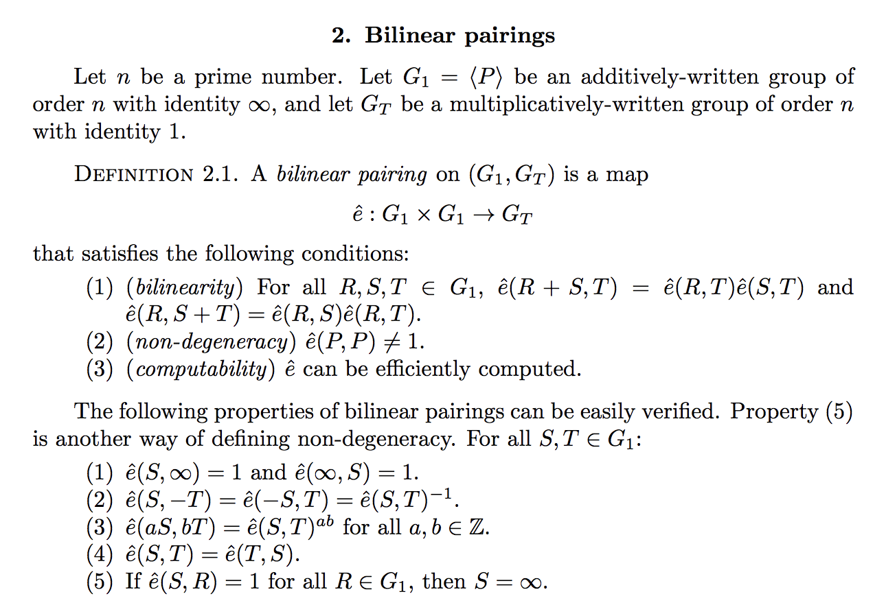

# ghili polynomial commitment scheme
a simple & elegant polynomial scheme with 
- O(1) commitment and proof sizes
- no trusted setups or groups of unknown order involved.

my beef with polynomial commitment schemes (transparent and trusted) was that commitments aren't made to polynomials, but rather hidden evaluations of a polynomial.
this is the reason trusted setups exist; to protect that hidden evaluation.
given two polynomials, *p* and *p'* (both of degree d), *p* and *p'* will intersect at at most *d* points. this makes it unlikely that you can cheat your way to a valid evaluation by using a different polynomial than what you commit to. an evaluation at a hidden point *𝜏* will be almost impossible to cheat, which is why keeping our trusted setup secure is important. if our point *𝜏* gets exposed, it could undermine the security of the commitment scheme.

> we can conclude that evaluation of any polynomial at an arbitrary point is akin to the
representation of its unique identity - from [this paper](https://arxiv.org/pdf/1906.07221.pdf)

i'd rather a polynomials commitment scheme that makes commitments to the polynomial coefficients explicitly, and then allow you to prove you know the result of their blind evaluation. the issue with commiting to coefficients is that their ordering must be made explicit in the commitment. how to do this while maintaining a constant size commitment is tricky cause elliptic curve groups are commutative.

## polynomial representations
to commit to a polynomial you need a way to represent it such that a commitment to *p* can't also be a commitment to *p'*. soon, you need to ask how do you give a polynomial an "id" of sorts. there's several ways of doing this:
- ordered list of coefficients i.e. { a_0, ..., a_n }
- spare list of coefficients and their exponent i.e. { (a_i, i), ..., (a_j, j), (a_n, n) } (no zeros in the list)
- point-value form i.e. {(x_1, y_1), ..., (x_n, y_n)} (not unique, two point-value sets can point to the same polynomial)
- evalutation at a point *r* i.e. p(r) (other polynomials of degree n can only intersect at at most n points, unlikely to find an intersection at *r*)
- factored form i.e. p(x) = (x - f_0)...(x - f_n) (ordering doesn't matter, the list is commutative)

[Kate commitments](https://alinush.github.io/2020/05/06/kzg-polynomial-commitments.html) choose to evaluate the polynomial at a **hidden** point *r*. makes for an easily succinct commitment but requires a trusted setup.

the first representations is impossible because of the ordering requirement in the list. commiting to the coeffs couldn't work in a commutative group. a quick example would be that commiting to 2x^2 + 3x + 5 would be the same commitment as 2x^2 + 5x + 3.

if it'll work in a elliptic curve group (for the hiding criteria) then it needs to work regardless of order.

## polynomial remainder theorem
the polynomial remainder theorem states p(a) = b   <=>   p(x) - b / x - a

so for x - r perfectly divides p(x) - p(a) for any x and a

## bilinear pairings
waterloo has a great [introduction paper](https://www.math.uwaterloo.ca/~ajmeneze/publications/pairings.pdf) on pairing-based cryptography. essentially a bilinear pairing is a map on elliptic curves that allows you to multiply two points on an elliptic curve together, even tho elliptic curves are an additive group and not a multiplicative one.

## the naive approach
 with a blind evaluation to compute  

this works fine, except the commitment size and computation time is now O(n), where n = deg(p)

we can do betteer

the ghili polynomial commitment scheme, like most polynomial commitment schemes, is comprised of a triple of algorithms
- **commit**: takes a polynomial *p* (represented as a list of coefficients) and returns the commitment *c*
- **open**: takes a commitment *c*, an integer *x*, and an integer *y* and returns the proof *π*
- **open**: takes a commitment *c*, an integer *x*, an integer *y*, and a proof *π* and returns either 0 or 1

it must be 
- **binding**: two polynomials *p* and *p'* cannot map to the same commitment *c*
- **hiding**: a polynomial *p* cannot be uncovered from a commitment *c*
- **efficient**: verifying an evaluation to a commmitment must be more efficient than evaluating the polynomial itself, so should be done in sublinear time

note that the binding criteria doesn't require *p* to map to a unique commitment *c*, so we can have commitments *c* and *c'* for a *p*. not exactly relevant in the literature but it might come in handy for new schemes.

## close but no dice :/
> note: this isn't binding, i.e. multiple different polynomials could map to the same commitment. if we want to commit to the coefficients we need a way to asign an order to em as well. how can we make it binding?

let g be a generator point in a group G

 where a_i is the i-th coefficient in a polynomial *p*

## progress?
this is the situation so far:
- commiting to a coefficient a_i is easy, it's just an integer so raise g to the a_i
- commiting to an ordered sequence (coefficient list of a polynomial) isn't feasible cause of how elliptic curve groups are commutative
  i.e. we could commit to *p* and *p'* with the same commitment *c*
- so commiting to a polynomial by explicitly commiting to it's coefficients won't be straightforward

point #1 provides a hint as how to go about this. we can commit to the coefficients individually, but making those the commitment gives us size O(n).
is there way to aggregate these coeffs injectively to get size O(1)?

i think the [PointProofs](https://eprint.iacr.org/2020/419.pdf) offers some guidance here. the paper introduces cross-commitment aggregation. commitments use a trusted setup with secret trapdoor *𝜏* **but** that trapdoor is not used for the a_0 coeff since it it's multiplied by x^0 which is 1. therefore, i'm hoping we can commit to polynomials p_i = a_i the same way we would commit to anythinng using PointProofs then we aggregate them.

tl;dr on the plan:
- commit to coefficients
- aggregate them somehow with PointProof techniques

## point-value commitments
them polynomial remaind theorem tells us x - r perfectly divides p(x) - p(a) for any x and a.
if we have a commitment to a point-value list like {(x_1, y_1), ..., (x_n, y_n)} maybe we can check any point *a* against our list. 
this approach is cool cause we won't need a trusted setup (no setup at all actually) cause there's no way to cheat this, a point-value list (of length n) will only correspond to *one* polynomial!
this is easy enough if we keep the list at hand but can we shrink the list to a constant size?
