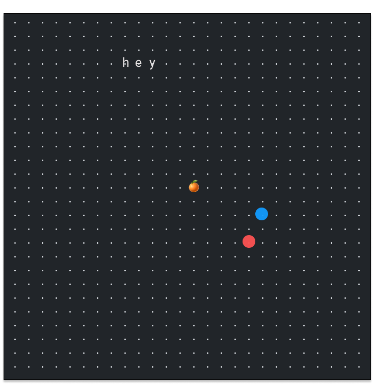

# 🌸🍊kotatsu: a new kind of space

this doc will outline a design for a privacy-first and local-first ~~social network~~ digital space

meant to be a safer/more comfy alternative to life online, looking to address several points from my [principles](principles.md) doc.

related: [bring your own client](https://www.geoffreylitt.com/2021/03/05/bring-your-own-client.html)

something like [sonar](https://apps.apple.com/us/app/sonar-make-vibes-with-friends/id1512829586)

the grand vision for kotatsu is a **forkable minimal gaming framework**.

## idea
- start off with an empty grid of dots (w/ infinite zoom), we call this the dot map/grid
- a dot that represents you can move across the dots if the dot is not occupied
- we introduce the notion of dots occupied with unicode characters
- you can shape your own experience on kotatsu by configuring the space however you want

kotatsu will integrate [braid](https://braid.org) to support:
- GET subscriptions
- bringing your own client

## design inspo
- zoomable uis [tweet](https://twitter.com/MatthewWSiu/status/1228155105683263490)
- nice video by house & garden [video](https://www.youtube.com/watch?v=VhTXrD6mWUw)
- hundred rabbits dotgrid [repo](https://github.com/hundredrabbits/Dotgrid)
